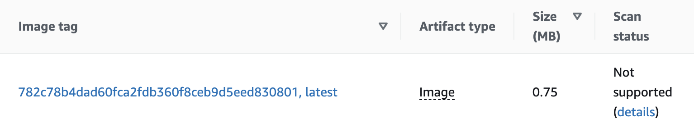

# **rust-on-lambda**

This example demonstrates how to deploy an `axum` application to an AWS Lambda function with images under **`1MB`**. The application is built `FROM scratch` to minimize overall cold start time and provides interoperability between a normal web server (`debug` mode) and a lambda application (`release` mode).

 

